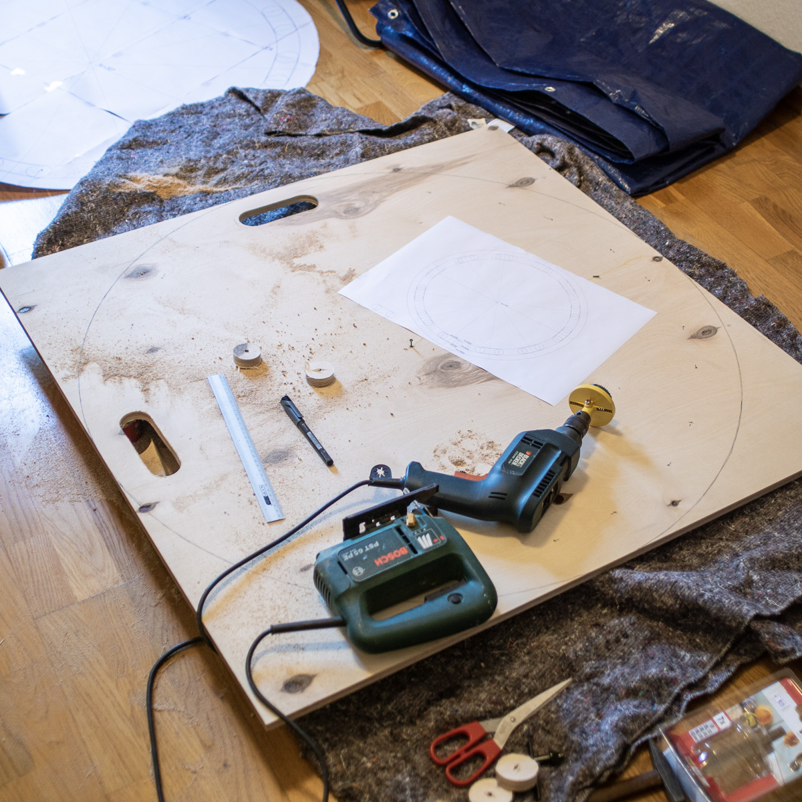

# (swedish) Throwing Board

This documentation will first show you how to build one for yourself. This includes some pictures and technical drawings. At the end it will give you a tutorial for basic usage. There is no video for the first steps yet, but we took some from advanced tricks:
- [normal salto / somersault](https://youtu.be/JZCmLkykNo0)
- [double salto](https://youtu.be/8LZQk9T78h4)

## Why

- its a fun and easy thing to do
- easier for the bases than banquine
- more spectacular than trampoline

## How to build one

- multiplex wood gives best stability and lowest weight
- it should fit in a normal car, so the outer diameter is limited to about 100 cm (this limitation depends on your preferences)
- the count of holes for the hands are best to be 12, so you can use the board with 2, 3, 4, 6 bases evenly
- you need at least a jigsaw, a hole-saw (powerdrill) and a lot of sandpaper (an additional mill / router makes your life so much easier)
- hand holes should be about 45 mm deep and the width of 140 mm should be enough for even the biggest hands

## My Build-log

- i chose birch multiplex with an area of 1 qm, 15 mm thickness and about 9 equal layers, the glue is water resistant and the board is stiff but able to flex very much before it breaks (i was able to test this with a long piece of trim at the home improvement store)
   - beech would be heavier but not significantly more stable
   - poplar would have the same weight but less stability
- the rectangular piece weights about 9.5 kg 
   - I calculated that the round board weights 7.46 kg, with holes cut it goes down to 6.74 kg
   - the real weight (after rounding the edges) came down to 6.7 kg
- i put a small screw in the middle of the board and attached a string to it to draw a circle at 865 mm and also 1000 mm diameter
- i made markings 30 degree apart (on the inner circle) and made a second marking 100 mm to the right of the first markings (also on the inner circle) to guide the hole-saw
- i used the power-drill / hole-saw to get started with the round edge-holes for the handles
- after that i could use a ruler to connect the holes and then use the jigsaw to follow the line
- the jigsaw is also used for cutting the outer circle
- a router bit should be used to round the edges
- sand paper can be used to smooth the handles, but the main surface should stay rough (!!!)
- i marked the middle of the board on both sides with a permanent marker
- i wanted to seal the surface but did not want to use any paint or varnish so i used olive oil
   - at first there was an instant regret because it was slippery as frick (who would have thought), but after two days (and one more coating) it was perfect
   - the surface is now a bit like rubber, good for standing bare foot on it
   
   

## how to use it

